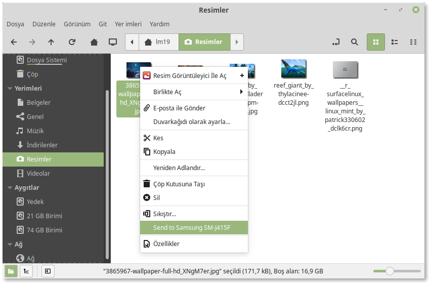

nemo-kdeconnect
====================
Nemo extension (based on a fixed nautilus-kdeconnect) for sending files to devices connected via KDE Connect.

KDE Connect is a service that connects your Android device with your Linux PC via Wi-Fi, enabling many features like shared clipboard, notification syncing, file sharing and media playback control. This extension provides file sharing support in Nemo via context menu (right-click menu).

Features
---------

* Send any number of files at once.  
  _(Directories are also supported and sent as ZIPs)_.
* Send files to any connected device.

Warning
-------

* The created ZIP files are not deleted again, and blindly overwrite any already existing ZIP of the same name.  
  *(This is a bug in the original repositories this is forked from, and isn’t fixed because it’s much more complex than it should be. **Patches are welcome!**)*

Installation
-------------

1. On your PC, install the `kdeconnect`, `python-nemo` `libnotify-bin` and `git` packages.

   If you are using some Debian-based distribution that is not *Linux Mint*, you won't find the `python-nemo` package in the software repositories:
     1. Download and install the [`python-nemo` package](http://packages.linuxmint.com/pool/backport/n/nemo-python/) from the *Linux Mint* package archive site.
     2. Run `sudo ln -s /usr/lib/nemo/extensions-3.0/libnemo-python.so /usr/lib/x86_64-linux-gnu/nemo/extensions-3.0/` to create a compatibility symlink to newly installed the extension file.
        
2. Install the **KDE Connect** app for Android as mentioned above:
     * Recommended, for your personal freedom: Fom [F-Droid](https://f-droid.org/repository/browse/?fdid=org.kde.kdeconnect_tp)
     * Or in case of emergency: From [Google Play](https://play.google.com/store/apps/details?id=org.kde.kdeconnect_tp)

3. Launch **KDE Connect** on your PC and on your Android device. Pair the two devices and enable the sharing plugin.

4. Clone this repository and install the extension with the **Nemo** target.

   `git clone https://github.com/navid-zamani/nemo-kdeconnect && make -C nemo-kdeconnect install TARGET=Nemo`

5. Re-start **Nemo**.
